<div align="center" width="100%">
    
</div>

# Dockge

A fancy, easy-to-use and reactive self-hosted docker compose.yaml stack-oriented manager.

> **Dockge is [Louis Lam](https://github.com/louislam)'s project** (he also created [Uptime Kuma](https://github.com/louislam/uptime-kuma)). The compose manager, the reactive real-time UI, the interactive terminal and multi-agent support are all his work.
>
> This repository is a fork of [Chris Cooper's fork](https://github.com/cmcooper1980/dockge) (cmcooper1980/dockge), which is itself based on [louislam/dockge](https://github.com/louislam/dockge). The [REST API](#rest-api) framework comes from [finder39's fork](https://github.com/finder39/dockge) ("Dockge Managed"). The sections below describe what this fork adds on top of that work. If you like Dockge, please ⭐ the [original project](https://github.com/louislam/dockge) too.

[](https://github.com/darthrater78/dockge) [](https://github.com/darthrater78/dockge/releases) [](https://github.com/darthrater78/dockge/commits/master/)

## 🆕 What's new in this fork: 2.3.0

Built on Louis's original design, 2.3.0 adds a redesigned phone layout, a resizable stack list on desktop, port conflicts you can't miss, and a Compose Drift Check that works everywhere. Full list in the [release notes](#release-notes).

<a id="mobile"></a>

### 📱 Mobile

On a phone, Dockge is built around one job: **find a stack → open it → edit it or act on it → watch what happens.**

<p align="center">
  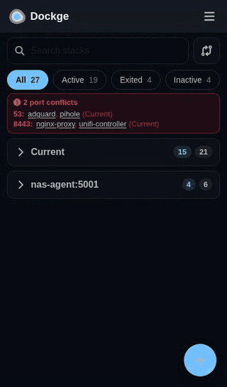
</p>

<table>
  <tr>
    <td align="center" width="33%">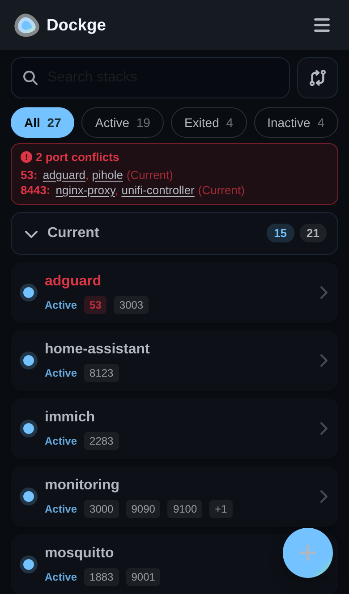<br /><b>Find</b></td>
    <td align="center" width="33%">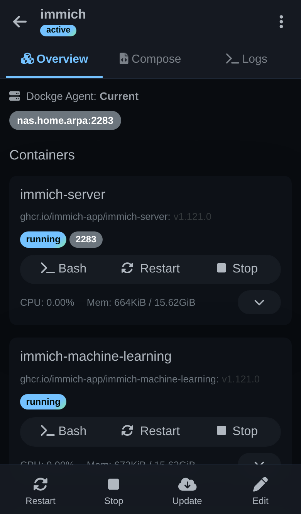<br /><b>Open</b></td>
    <td align="center" width="33%">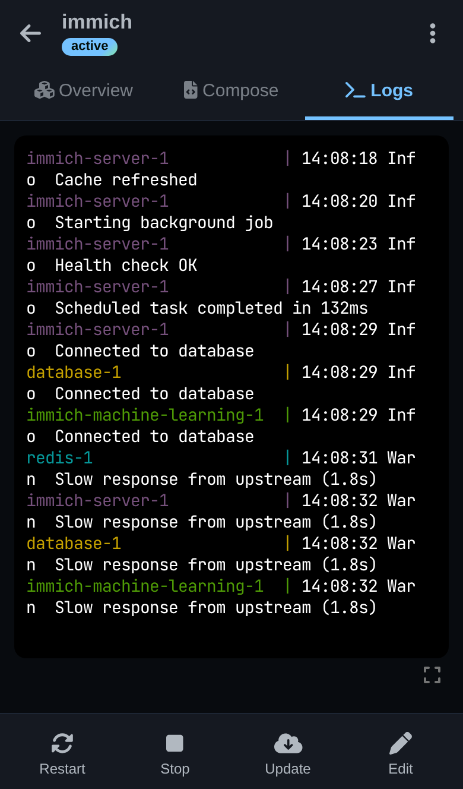<br /><b>Watch</b></td>
  </tr>
  <tr>
    <td align="center">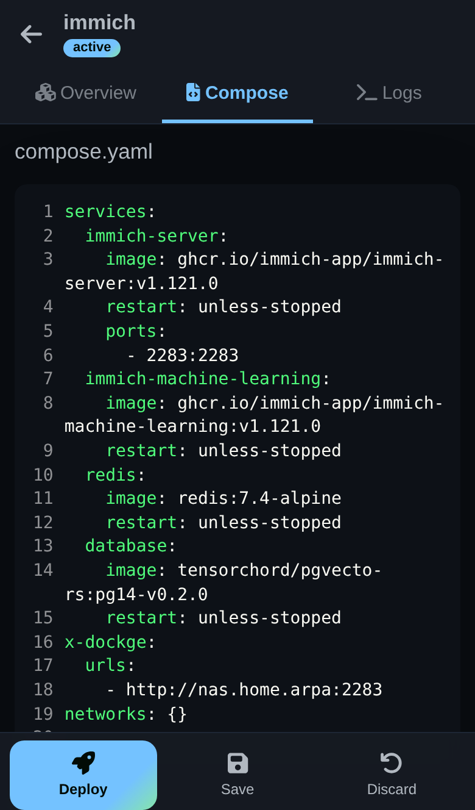<br /><b>Edit</b></td>
    <td align="center">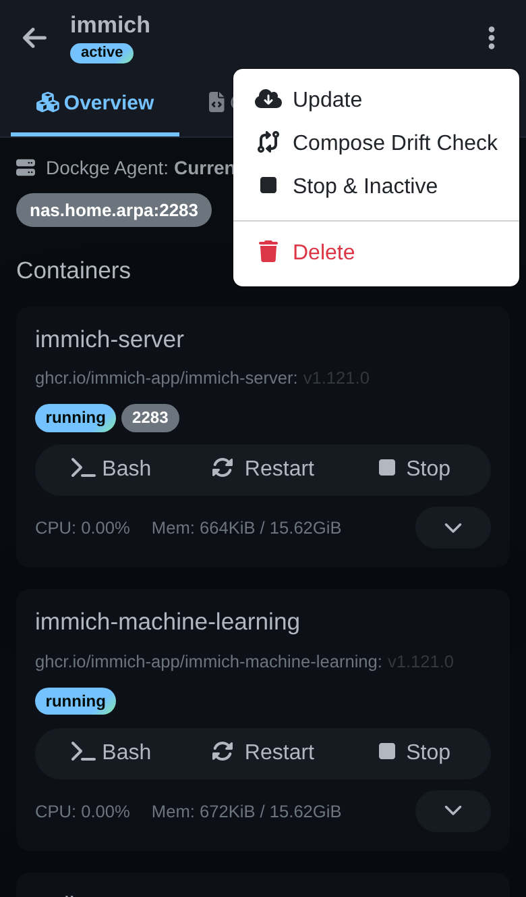<br /><b>More actions</b></td>
    <td align="center">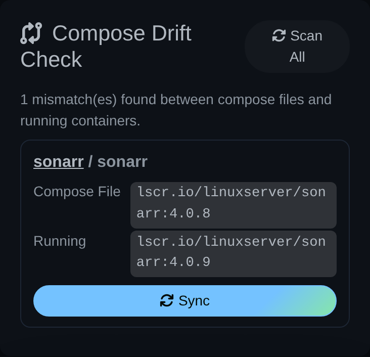<br /><b>Drift check</b></td>
  </tr>
</table>

- **The stack list is the home screen.** Search by stack name, agent or port; filter by status (Active / Exited / Inactive, with counts) or by **Port conflicts**. Each stack is one card: status, name and its host ports, conflicting ports first and in red.
- **One section per agent.** With more than one Dockge agent, stacks are grouped under a collapsible header per agent showing running / total counts. Sections start collapsed; searching or filtering opens them so matches are never hidden.
- **Port conflict banner** at the top of the list names each conflicting port and the stacks publishing it (tap a name to open that stack).
- **Stack page:** a top bar with back, name and status, and a ⋮ menu for the less common actions (Update, Compose Drift Check, Down, Delete). Three tabs:
  - **Overview:** which agent the stack runs on, its URLs, and each container with its status, ports and Bash / Restart / Stop.
  - **Compose:** `compose.yaml`, `.env` and `compose.override.yaml` when present.
  - **Logs:** the combined stack log, filling the screen (expandable to full screen).
- **Bottom action bar**, where your thumb is: **Start** or **Restart**, **Stop**, **Update**, **Edit**. While editing it becomes **Deploy**, **Save** and **Discard**. Any action switches to the Logs tab so you see its output live, and the tab shows a dot while it runs.
- **Menu (☰)** for Stacks, Overview, Compose Drift Check, Console, Settings, Scan Stacks Folder and Logout, so the bottom of the screen is free for the stack actions.
- **Compose Drift Check** is one tap away (the button beside the search box); on a phone its results are cards with the compose and running image and a Sync button.

<a id="desktop"></a>

### 🖥️ Desktop

**Resizable stack list.** Drag the handle between the stack list and the page to make the list wider or narrower (arrow keys work when the handle is focused; double-click resets it). The width is remembered. Port badges show as many ports as fit the current width, with the rest behind "+N", and a conflicting port is always shown first. When the list gets narrow, the Compose Drift Check button shrinks to its icon so the search box keeps its room.

<p align="center">
  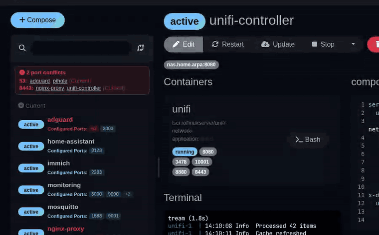
</p>

**Resizable terminals** (since 2.2.0). Every terminal panel (stack logs, console, container shell) has a drag handle to make it taller and a button to expand it to full screen; Esc restores it. Each page remembers its own height.

<p align="center">
  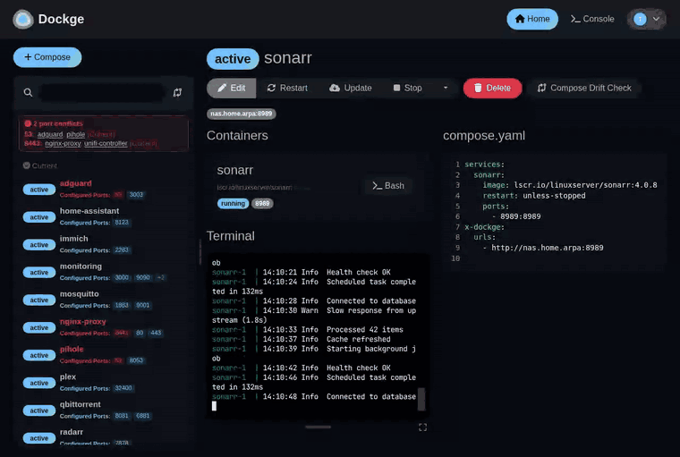
</p>

**Port conflicts at a glance.** The banner above the stack list lists every host port that more than one running stack publishes, per agent, with links to the stacks involved.

<p align="center">
  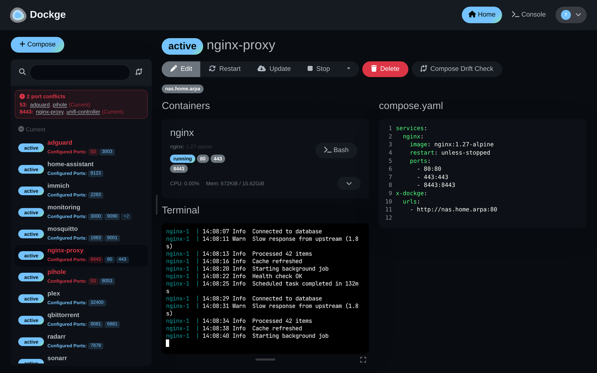
</p>

<a id="drift-check"></a>

### 🔄 Compose Drift Check

Compose Drift Check (added in this fork in 1.7.0) finds services whose `compose.yaml` pins a different image tag than the container actually running, and **Sync** writes the running tag back into the compose file (comments preserved). In 2.3.0:

- **"Scan All" no longer times out.** It used to run `docker ps` plus two `docker inspect` calls *per container, for every stack*, so any host with more than a handful of containers hit the 30-second limit. A scan now makes three docker calls in total and finishes in a couple of seconds.
- **On phones** it's one tap from the stack list (the button beside the search box, or ☰ → Compose Drift Check), and per stack from the ⋮ menu.
- **Results fit the space.** Each mismatch is a card (stack / service, compose image, running image, Sync) on phones and whenever the panel is too narrow for the table, so the Sync button is never scrolled out of view.

<table>
  <tr>
    <td align="center">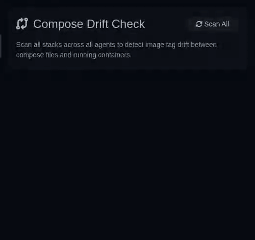<br /><b>Desktop:</b> Scan All, then Sync</td>
    <td align="center">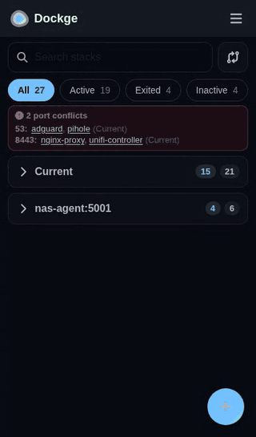<br /><b>Phone:</b> from the stack list</td>
  </tr>
</table>

---


View Video: https://youtu.be/AWAlOQeNpgU?t=48

---

## 🤖 Built by Claude Code

> **Every line of new code in this fork — from v1.5.2 onward — was written entirely by [Claude Code](https://claude.ai/code), Anthropic's AI coding agent.** No human wrote the implementation code. A human ([@darthrater78](https://github.com/darthrater78)) directed the work: describing features, reviewing PRs, and approving releases, but Claude Code authored all source changes, security fixes, documentation, and release engineering across **8 feature releases and 33+ commits**.

### What Claude Code built in this fork

Starting from [Chris Cooper's fork](https://github.com/cmcooper1980/dockge) of [louislam/dockge](https://github.com/louislam/dockge) (upstream v1.4.2), Claude Code implemented the following — each delivered as a branch, PR, security-reviewed build, and tagged release:

| Version | What was built | Scope |
|---------|---------------|-------|
| **v1.5.2** | Agent name column migration fix | Database migration that existing installs missed |
| **v1.5.3** | Security hardening | Path traversal fix, JWT expiry (30-day), XSS sanitization, password model fix, nightly CI workflow |
| **v1.6.0** | REST API (ported) | Ported from [finder39/dockge](https://github.com/finder39/dockge) and adapted to this fork's architecture — 13 endpoints, API key auth, stack validation, update history, auto-update scheduler |
| **v1.6.1** | Settings UI | Frontend for API key management, cron scheduler, per-stack auto-update toggle |
| **v1.6.2** | Stack lifecycle API | `POST /api/stacks/:name/down` endpoint completing the full start/stop/restart/down lifecycle |
| **v1.6.3** | API data fix | Container state, status, health, and image info populated in `GET /api/stacks` responses |
| **v1.7.0** | Compose Drift Check | Detect image tag drift between running containers and compose files, one-click sync, YAML-comment-preserving writes, sync history with revert, multi-host agent support |
| **v1.7.1** | Global drift scan | "Scan All" button on Home page scanning every stack on every connected agent |
| **v1.8.0** | Feature removal & rename | Removed skopeo-based image update detection (too complex, unreliable), renamed to "Compose Drift Check" |
| **v1.8.1** | Dark mode & reliability | Fixed Bootstrap CSS overrides breaking dark mode, added 30s agent timeout for offline nodes |
| **v1.8.2** | Security patch | Updated ws (HIGH — memory disclosure/DoS), yaml (MODERATE — stack overflow), express (body-parser DoS, ReDoS, qs bypass) |
| **v1.9.0** | 2FA & encryption | TOTP two-factor authentication, `.env` file persistence on stack save, AES-256-GCM encryption for agent credentials at rest, terminal shell allowlist |
| **v1.9.1** | Update button restored | Re-added compose pull + up update button and API endpoint removed in 1.8.0, fixed About page links |
| **v1.9.2** | Fork independence & security | Docker images from fork GHCR registry, dependency security fixes (mysql2, vite), CI cleanup |
| **v2.0.0** | Port visibility | Configured-port badges and HOST badge in the stack list, cross-stack port conflict detection scoped per agent, dev CI workflow, pre-release Docker tag support |
| **v2.1.0** | CI hardening, CVE fixes & mobile UX | SHA-pinned GitHub Actions, tag-on-default-branch release verification, Dependabot config; `npm overrides` closing Critical/High CVEs in `tar`/`lodash`/`glob` with no upstream fix available; resizable terminal panel; fixed mobile navigation (`isMobile` was referenced everywhere but never defined, hiding all nav on phones) |
| **v2.2.0** | Expandable terminal, mobile polish & audit fixes | Terminal panels on the stack, console and container pages can be dragged taller or expanded to full screen; fixed terminals hiding their newest lines (xterm measured before the web font loaded); server pty now follows the panel size; mobile header and tidier stack actions; release workflow now requires passing CI and a matching tag; anti-framing headers (`DOCKGE_ALLOW_FRAMING` opt-out); private vulnerability reporting |
| **v2.3.0** | Mobile redesign, resizable desktop list & fast drift scan | Phone layout rebuilt around find → edit → act: searchable stack list with status filters and collapsible per-agent sections, stack page with Overview / Compose / Logs tabs and a bottom action bar; port-conflict banner naming the ports and stacks; conflicting ports no longer hidden behind the "+N" badge; resizable stack list on desktop with port badges that fit its width; Compose Drift Check reachable on mobile and no longer times out on larger hosts (docker queried once per scan instead of per stack and container); `:dev` GHCR channel for branch builds |

### How it worked

1. **Human direction** — The maintainer described what to build ("add a REST API", "detect image drift", "add 2FA") and provided architectural preferences
2. **Claude Code implementation** — Claude Code read the existing codebase, designed the changes, wrote the code, and produced working builds
3. **Security gate** — Every build went through a security scan checking for hardcoded secrets, injection vectors, path traversal, weak crypto, and dependency CVEs before any commit
4. **Review & release** — The maintainer reviewed each PR, tested the build, and approved the release. Claude Code authored the release notes, tags, and changelog entries

All Claude-authored commits carry a `Co-Authored-By: Claude` trailer in the git history. PR branches are prefixed with `claude/`.

### The Dev Skills gate system

Starting with later releases, development used a custom **Dev Skills** discipline — a structured set of mandatory gates that Claude Code enforces on itself before any code can be committed, pushed, or released. This changed the quality of the output significantly compared to earlier releases that relied on ad-hoc review.

The gate system works like a pre-flight checklist that cannot be skipped:

```
🔢 VERSION  →  🔨 BUILD  →  🔒 SECURITY  →  📄 DOCS  →  📦 RELEASE  →  🚀 SHIP
```

**What each gate catches:**

1. **Version Gate** — Every version-carrying file in the project (package.json, source code, UI strings) must agree. Claude Code greps the entire codebase for hardcoded version strings — a missed version in a window title or "About" dialog is a gate failure. The repository URL must also be present in manifests.

2. **Build Gate** — A test build must be created and verified working before anything is committed. Not "it compiled" — the app must start, the golden path must work, and no regressions should be visible.

3. **Security & Quality Gate** — This is where the biggest improvement happened. After every successful build, Claude Code runs a full scan of all source files against a detailed security checklist:
   - **Hard stops** (must fix): hardcoded secrets, SQL injection, `shell=True` with user input, disabled TLS, pickle on untrusted data, path traversal, missing auth, debug mode in production, weak crypto
   - **Quality review**: N+1 queries, god functions (>40 lines), deep nesting, wrong data structures, string concatenation in loops, unbounded caches, missing database indexes
   - The security scan also runs the project's native `npm audit` and checks every dependency for typosquatting, maintenance health, and known CVEs

4. **Docs Gate** — Changelog entries, README updates for new/changed/removed features, and stale documentation are all checked before release.

5. **Release & Ship Gates** — Branch protection is enforced (never commit directly to main), release notes must be reviewed and approved, and the final ship requires explicit human confirmation.

**How this made the image better:**

- **v1.5.3's security hardening** (path traversal, JWT expiry, XSS fixes) came directly from the security gate catching patterns in the existing codebase
- **v1.8.2's dependency patches** (ws memory disclosure, yaml stack overflow, express DoS) were surfaced by the mandatory `npm audit` step
- **v1.9.0's terminal shell allowlist** and **agent credential encryption** were security gate findings — Claude Code flagged that terminal commands accepted arbitrary shells and that agent passwords were stored in plaintext, then fixed both before the build could pass
- **Earlier releases without the gate system** shipped features that later had to be removed (the skopeo-based image update detection in v1.8.0) — the quality gate's complexity review would likely have flagged that design as too fragile before it shipped

The gate system means no commit happens without a security scan, no release ships without verified docs, and no push goes out without the maintainer explicitly typing "push." It turns Claude Code from a code generator into a disciplined release engineer.

### Community contributions cherry-picked into this fork

This fork stands on the work of the upstream project and its community. The following features were cherry-picked from open pull requests on [louislam/dockge](https://github.com/louislam/dockge) and integrated before Claude Code development began:

| Contributor | Feature | Upstream PR |
|-------------|---------|-------------|
| [Elias Floreteng](https://github.com/eliasfloreteng) | Compose override editor — edit `compose.override.yaml` alongside the main compose file | [#23](https://github.com/louislam/dockge/pull/23) |
| [Richy HBM](https://github.com/RichyHBM) | PUID/PGID support — set stack file/directory ownership | [#83](https://github.com/louislam/dockge/pull/83) |
| [Kevin (syko9000)](https://github.com/syko9000) | Global `.env` editor and usage in docker operations | [#387](https://github.com/louislam/dockge/pull/387) |
| [Julian (skl)](https://github.com/skl) | Agent friendly name — set/update display names for remote agents | [#414](https://github.com/louislam/dockge/pull/414) |
| [CampaniaGuy](https://github.com/CampaniaGuy) | Theme options — light/dark/auto theme selection in settings | [#575](https://github.com/louislam/dockge/pull/575) |
| [Niraj Yadav](https://github.com/nickkdev) | Remove terminal buffer console logging | [#582](https://github.com/louislam/dockge/pull/582) |
| [Lance Cain (mizady)](https://github.com/mizady) | Container control buttons — start/stop/restart individual containers | [#649](https://github.com/louislam/dockge/pull/649) |
| [Justin Wiebe](https://github.com/justwiebe) | Resource usage stats on the compose page (CPU, memory per container) | [#700](https://github.com/louislam/dockge/pull/700) |
| [Joshua Anderson (andersmmg)](https://github.com/andersmmg) | Replace textarea editor with CodeMirror (syntax highlighting, line numbers) | [#786](https://github.com/louislam/dockge/pull/786) |
| [Matthew McConnell (maca134)](https://github.com/maca134) | Improved stack list UI when using agents | [#800](https://github.com/louislam/dockge/pull/800) |
| [Dimariqe](https://github.com/Dimariqe) | Clipboard copy/paste support in the web terminal | [#822](https://github.com/louislam/dockge/pull/822) |
| [nullcat](https://github.com/nullcat) | Fix `isComposeExitClean` TypeError when compose is stopped | [#37](https://github.com/louislam/dockge/pull/37) |
| [Aymen Djellal](https://github.com/aymen-djellal) | Improve JSON parsing with error handling | [#25](https://github.com/louislam/dockge/pull/25) |
| [Grant Birkinbine](https://github.com/GrantBirki) | Update json-yaml-validate to latest version | [#446](https://github.com/louislam/dockge/pull/446) |

**REST API origin — [finder39/dockge](https://github.com/finder39/dockge):**
The REST API framework (v1.6.0) was ported from finder39's Dockge fork ("Dockge Managed"), which implemented the original API router, auto-update scheduler, image update detection via skopeo, and update history tracking. Claude Code adapted the code to work with this fork's architecture and added backward compatibility for mixed-version agent deployments.

**Base fork — [Chris Cooper (cmcooper1980)](https://github.com/cmcooper1980):**
This repository is forked from [cmcooper1980/dockge](https://github.com/cmcooper1980/dockge). Chris's fork contributed, among other work:
- Cloudflare Turnstile CAPTCHA integration on login
- "Update All" button for bulk stack updates
- v-html XSS vulnerability fixes and npm audit cleanup
- Variable highlighting in the CodeMirror editor
- Agent display logic improvements
- Compose override editor refinements (dynamic titles, component naming)

**Upstream — [Louis Lam (louislam)](https://github.com/louislam):**
Dockge itself is Louis Lam's project. This fork (by way of [Chris Cooper's fork](https://github.com/cmcooper1980/dockge)) is built on top of the [original Dockge](https://github.com/louislam/dockge) at v1.4.2, which includes the core compose manager, interactive terminal, multi-agent support, and the reactive real-time UI.

---

## ⭐ Features

- 📱 (2.3.0 🆕) Mobile-first phone layout — find a stack, edit it, act on it and watch its logs, all within thumb reach ([details](#mobile))
- ↔️ (2.3.0 🆕) Resizable stack list on desktop, with port badges that fill whatever width you give it ([details](#desktop))
- 🚦 (2.3.0 🆕) Port conflict banner — every host port published by more than one running stack, and which stacks they are
- 🧑‍💼 Manage your `compose.yaml` files
  - Create/Edit/Start/Stop/Restart/Update/Delete
- ⌨️ Interactive Editor for `compose.yaml`
- 🦦 Interactive Web Terminal
- 🕷️ (1.4.0 🆕) Multiple agents support - You can manage multiple stacks from different Docker hosts in one single interface
- 🏪 Convert `docker run ...` commands into `compose.yaml`
- 📙 File based structure - Dockge won't kidnap your compose files, they are stored on your drive as usual. You can interact with them using normal `docker compose` commands
- 🧩 (1.5.1 🆕) Compose override editor - Edit `compose.override.yaml` alongside your main compose file, when present
- 🔐 (1.5.1 🆕) Optional Cloudflare Turnstile CAPTCHA on login
- 🌐 (1.6.0 🆕) REST API for external automation (CI/CD, scripts, monitoring)
- 🔄 (1.7.0 🆕) Compose Drift Check — detect and fix image tag drift between running containers and compose files (2.3.0: fast "Scan All", works on phones — [details](#drift-check))
- 🔑 (1.9.0 🆕) Two-Factor Authentication (TOTP) — protect your account with app-based 2FA


- 🚄 Reactive - Everything is just responsive. Progress (Pull/Up/Down) and terminal output are in real-time
- 🐣 Easy-to-use & fancy UI - If you love Uptime Kuma's UI/UX, you will love this one too


## 🔧 How to Install

Requirements:
- [Docker](https://docs.docker.com/engine/install/) 20+ / Podman
- (Podman only) podman-docker (Debian: `apt install podman-docker`)
- OS:
  - Major Linux distros that can run Docker/Podman such as:
     - ✅ Ubuntu
     - ✅ Debian (Bullseye or newer)
     - ✅ Raspbian (Bullseye or newer)
     - ✅ CentOS
     - ✅ Fedora
     - ✅ ArchLinux
  - ❌ Debian/Raspbian Buster or lower is not supported
  - ❌ Windows (Will be supported later)
- Arch: armv7, arm64, amd64 (a.k.a x86_64)

### Basic

- Compose file and Dockge's data: `/opt/docker/dockge`
- Stacks directory: `/opt/docker/stacks`
- Port: 5001

```bash
# Create the folders (needs root under /opt), make Dockge's folder yours, and go there
sudo mkdir -p /opt/docker/dockge/data /opt/docker/stacks \
  && sudo chown "$USER": /opt/docker/dockge && cd /opt/docker/dockge

# Download the compose file (saved as compose.yaml)
curl https://raw.githubusercontent.com/darthrater78/dockge/master/compose.yaml --output compose.yaml

# Start Dockge
docker compose up -d
```

Dockge is now running on http://localhost:5001

Already running Dockge from another folder (such as `/opt/dockge` from older instructions)? Nothing needs to move; these paths are just the recommended layout for new installs.

### Advanced

To use a different stacks directory or port, generate a compose file with the [interactive generator](https://dockge.kuma.pet) or its URL, and save it in `/opt/docker/dockge`:

```bash
curl "https://dockge.kuma.pet/compose.yaml?port=5001&stacksPath=/opt/docker/stacks" --output compose.yaml
```

Then set its `image:` to `ghcr.io/darthrater78/dockge:2.3.0` (the generator uses the upstream image). To set the owner of stack files, add under `environment:` (both are needed; the default is `root`):

```yaml
      - PUID=1000
      - PGID=1000
```

### -OR- copy and paste

Save this as `/opt/docker/dockge/compose.yaml` (create the folders first: `sudo mkdir -p /opt/docker/dockge/data /opt/docker/stacks && sudo chown "$USER": /opt/docker/dockge`), then run `docker compose up -d` in that folder:

```yaml
services:
  dockge:
    image: ghcr.io/darthrater78/dockge:2.3.0
    restart: unless-stopped
    ports:
      - 5001:5001
    volumes:
      - /var/run/docker.sock:/var/run/docker.sock
      - /opt/docker/dockge/data:/app/data
      - /opt/docker/stacks:/opt/docker/stacks
    environment:
      - DOCKGE_STACKS_DIR=/opt/docker/stacks

# ports: 5001 is Dockge's web UI (host:container).
#   To listen on one address only: 192.168.1.10:5001:5001
# /var/run/docker.sock: lets Dockge run docker compose for your stacks
#   (root-equivalent access to Docker).
# /opt/docker/dockge/data: Dockge's database and settings (login, agents,
#   API keys). Back this folder up.
# /opt/docker/stacks: your stacks. Both sides MUST be the same full path and
#   MUST match DOCKGE_STACKS_DIR, or stack files end up in the wrong place.
# DOCKGE_STACKS_DIR: where Dockge looks for stacks (same path as above).
# Optional, under environment:
#   - PUID=1000 and - PGID=1000: owner of stack files (both needed; default root)
#   - TURNSTILE_SITE_KEY=... and - TURNSTILE_SECRET_KEY=...: CAPTCHA on login
#   - DOCKGE_ALLOW_FRAMING=true: allow embedding in a dashboard iframe
# Optional, under volumes:
#   - /root/.docker/:/root/.docker: registry logins for private images
```

## How to Update

The compose file pins a release (`ghcr.io/darthrater78/dockge:2.3.0`) so an update never happens by surprise.

### One-line update

Dockge can't update itself (restarting its own container would cut the update off halfway), so run this on the Docker host. Set `V` to the [latest release](https://github.com/darthrater78/dockge/releases/latest):

```bash
V=2.3.0; F=/opt/docker/dockge/compose.yaml
S=; docker ps >/dev/null 2>&1 || S=sudo; $S docker pull ghcr.io/darthrater78/dockge:$V \
  && $S sed -i.bak -E "s#(ghcr\.io/darthrater78/dockge:)[^[:space:]]+#\1$V#" "$F" \
  && $S docker compose -f "$F" up -d dockge && $S docker compose -f "$F" ps dockge \
  && echo "✅ Dockge updated to $V" || echo "❌ Update stopped: see the error above"
```

1. **Pulls the new image first.** If that version doesn't exist, it stops before anything changes.
2. **Changes only the image tag** in your compose file, keeping the original as `compose.yaml.bak`. Ports, volumes and environment are untouched.
3. **Recreates the Dockge container** on the new image and shows its status. Your stacks keep running; only Dockge restarts.

It works from any folder, and uses `sudo` automatically if your user isn't allowed to run `docker` directly. Roll back with `mv /opt/docker/dockge/compose.yaml.bak /opt/docker/dockge/compose.yaml` and the same `docker compose -f … up -d dockge`.

**Compose file somewhere else?** Ask Docker where it was started from, and use that path as `F`:

```bash
sudo docker ps -a \
  --format '{{.Names}}  →  {{.Label "com.docker.compose.project.config_files"}}' \
  | grep -i dockge
```

### Always on the newest release

Prefer not to pin? Use `ghcr.io/darthrater78/dockge:latest` in your compose file, then update with:

```bash
cd /opt/docker/dockge && docker compose pull && docker compose up -d
```

## Optional: Cloudflare Turnstile CAPTCHA

To require a CAPTCHA challenge on the login page, set both of the following environment variables on the Dockge container. If either is unset, CAPTCHA verification is skipped.

```
      - TURNSTILE_SITE_KEY=<your Turnstile site key>
      - TURNSTILE_SECRET_KEY=<your Turnstile secret key>
```

Keys can be created in the [Cloudflare dashboard](https://developers.cloudflare.com/turnstile/get-started/).

## Optional: Embedding Dockge in a dashboard

By default Dockge refuses to be shown inside an iframe on another site (`X-Frame-Options: SAMEORIGIN`, `frame-ancestors 'self'`), because a page that frames it could trick you into clicking Docker actions. If you embed Dockge in a dashboard such as Home Assistant or Organizr, set:

```
      - DOCKGE_ALLOW_FRAMING=true
```

Only do this if Dockge is not reachable from untrusted networks.

<a id="rest-api"></a>

## REST API

*The API framework is ported from [finder39/dockge](https://github.com/finder39/dockge) ("Dockge Managed"), which wrote the original API router, auto-update scheduler and update history; it was adapted to this fork's architecture in v1.6.0.*

Dockge v1.6.0 introduces a REST API for managing stacks programmatically. The API runs on the master node only — agents do not need any changes and continue to communicate via Socket.IO.

### Authentication

All API endpoints require a static API key passed in the `X-API-Key` header.

Set your API key via environment variable:
```
      - DOCKGE_API_KEY=your-secret-api-key-here
```

Or set it at runtime through the UI/socket settings. The key is stored as a SHA-256 hash.

### Endpoints

| Method | Path | Description |
|--------|------|-------------|
| `GET` | `/api/stacks` | List all stacks (local and remote agents) |
| `GET` | `/api/stacks/:name` | Get details for a single stack |
| `POST` | `/api/stacks/:name/start` | Start a stack |
| `POST` | `/api/stacks/:name/stop` | Stop a stack |
| `POST` | `/api/stacks/:name/restart` | Restart a stack |
| `POST` | `/api/stacks/:name/update` | Pull images and restart a stack |
| `POST` | `/api/stacks/:name/down` | Tear down a stack |
| `GET` | `/api/version-sync/scan` | Scan for image tag mismatches between compose files and running containers |
| `POST` | `/api/version-sync/sync` | Sync a specific service's compose image to the running version |
| `POST` | `/api/version-sync/sync-all` | Sync all mismatched services for a stack |
| `GET` | `/api/version-sync/history` | Query version sync history with pagination |
| `POST` | `/api/version-sync/revert` | Revert a previous version sync |

### Query Parameters

**`GET /api/stacks`** and **`GET /api/stacks/:name`** accept:
- `?endpoint=hostname:port` — target a specific remote agent

**`GET /api/version-sync/scan`** accepts:
- `?stackName=mystack` — scan a specific stack (omit to scan all)
- `?endpoint=hostname:port` — target a specific remote agent

**`POST /api/version-sync/sync`** accepts JSON body:
- `stackName` (string, required) — stack to sync
- `service` (string, required) — service name within the stack
- `newImage` (string, required) — image tag to write into the compose file

**`POST /api/version-sync/sync-all`** accepts JSON body:
- `stackName` (string, required) — stack to sync all mismatches for

**`GET /api/version-sync/history`** accepts:
- `?page=1&limit=20` — pagination
- `?stackName=mystack` — filter by stack name
- `?service=myservice` — filter by service name

**`POST /api/version-sync/revert`** accepts JSON body:
- `stackName` (string, required) — stack containing the service to revert
- `service` (string, required) — service to revert to its previous image

### Example

```bash
# List all stacks
curl -H "X-API-Key: your-key" http://localhost:5001/api/stacks

# Scan all stacks for compose/running image mismatches
curl -H "X-API-Key: your-key" http://localhost:5001/api/version-sync/scan

# Scan a specific stack
curl -H "X-API-Key: your-key" "http://localhost:5001/api/version-sync/scan?stackName=myapp"

# Sync a service to its running image
curl -X POST -H "X-API-Key: your-key" -H "Content-Type: application/json" \
  -d '{"stackName":"myapp","service":"web","newImage":"nginx:1.27"}' \
  http://localhost:5001/api/version-sync/sync

# Revert a previous sync
curl -X POST -H "X-API-Key: your-key" -H "Content-Type: application/json" \
  -d '{"stackName":"myapp","service":"web"}' \
  http://localhost:5001/api/version-sync/revert
```

### Agent Compatibility

The API communicates with remote agents via Socket.IO. Agents running pre-1.6.0 versions are supported with graceful degradation:
- Stack listing falls back to legacy call signatures
- Unsupported agents are listed in the response so you know which nodes need upgrading

**Compose Drift Check requires v1.7.0 on all instances.** The master Dockge and every agent must run v1.7.0 or later for Compose Drift Check to work. The scan and sync commands are registered as new socket events (`scanVersionSync`, `syncVersion`, `syncAllVersions`, `revertVersionSync`) — agents running older versions will not respond to these events. The global scan on the Home page (on phones: ☰ → Compose Drift Check, or the button beside the stack search) only contacts agents that are online; offline or pre-1.7.0 agents are skipped with a warning.

**Agent credential encryption (v1.9.0):** Agent passwords are now encrypted at rest using AES-256-GCM. A one-time migration encrypts existing plaintext passwords on first startup. Remote agents do not need updating — the wire protocol is unchanged. However, rolling back the primary to a pre-1.9.0 version after migration will break agent authentication; back up the SQLite database before upgrading.

## Version History

<a id="release-notes"></a>

### 2.3.0 (2026-09-25)

**Changed**
- Mobile layout redesigned around finding a stack, editing it and acting on it; the bottom navigation bar is gone
  - Home is the stack list: search (name, agent or port), status filter chips with counts, one card per stack; with several agents, a collapsible section per agent (collapsed until opened or searched)
  - Stack page: back / name / status bar with a ⋮ menu (Update, Compose Drift Check, Down, Delete), Overview / Compose / Logs tabs, and a bottom action bar (Start or Restart, Stop, Update, Edit; Deploy, Save, Discard while editing). Actions switch to the Logs tab to show their output
  - Menu sheet (☰) for Stacks, Overview, Compose Drift Check, Console, Settings, Scan Stacks Folder and Logout
  - Compose Drift Check button next to the search box; its results are cards (stack / service, compose vs running image, Sync) on phones and whenever the panel is too narrow for the table
- Desktop: the stack list pane can be dragged wider or narrower (arrow keys on the handle; double-click resets); the width is remembered

**Added**
- Port conflict banner above the stack list naming each conflicting port and the stacks that publish it; "Port conflicts" filter on mobile
- `v<x.y.z>-dev.<n>` tags may be released from a feature branch and publish `:dev` + the version tag; stable tags remain default-branch only
- README: "What's new" section at the top with screenshots and GIFs of the mobile layout, desktop resizing and Compose Drift Check (`docs/images/`, kept out of the Docker image)
- Compose quickstart (README and `compose.yaml`) pins the image to the release (`:2.3.0`) instead of `:latest`; "How to Update" explains both

**Fixed**
- A conflicting port past the third one was hidden behind the "+N" badge; conflicting ports now sort first and the badge turns red when it hides one
- Duplicate host ports (e.g. `6881/tcp` and `6881/udp`) are shown once in the stack list
- Desktop stack list shows as many port badges as fit the pane width (was a fixed three)
- "Scan All" in Compose Drift Check timed out on hosts with more than a handful of containers: every stack re-ran `docker ps` plus two `docker inspect` calls per container. A scan now makes three docker calls in total

### 2.2.0 (2026-09-23)

**Added**
- Expandable terminal: every terminal panel (stack logs, console, container shell) has a drag handle (mouse, touch or arrow keys) and a full-screen toggle (Esc to restore); each page remembers its height
- Compact header on mobile; stack action buttons wrap into even rows on narrow screens
- `DOCKGE_ALLOW_FRAMING=true` to allow embedding Dockge in dashboards (see "Embedding Dockge in a dashboard")

**Fixed**
- Terminals no longer hide their newest lines below the panel: xterm measured its cells before the JetBrains Mono web font loaded and never re-measured
- The server-side pty now follows the panel size (it stayed at its initial size, so full-screen programs drew at the wrong size)
- REST API stack actions (`start`/`stop`/`restart`/`update`/`down`) now apply `global.env`, the stack `.env` and `compose.override.yaml`, the same as the UI
- The "expand" icon on the stack page was never registered and rendered blank
- The update-available link pointed at v2.1.0 instead of the latest release
- A failed Docker build in the release could be reported as success (`env2arg.js` ignored the exit code)

**Security**
- Anti-framing headers (`X-Frame-Options: SAMEORIGIN`, `frame-ancestors 'self'`), `nosniff`, `Referrer-Policy`; `X-Powered-By` removed
- Release workflow: default-branch check also applies to manual runs, the tag must match `package.json`, and CI must have passed for the tagged commit
- Terminal resize requests, API paging and `POST /api/agents` input are validated; first-run setup can no longer race into two admin accounts
- Healthcheck built with Go 1.27.1 (was 1.21.4); base images pinned by digest and watched by Dependabot
- Security reports now go to this fork's private vulnerability reporting
- `@xterm/xterm` pinned to stable 6.0.0 (was the floating `beta` tag)
- `.claude/` and `.github/` excluded from the Docker build context (the image was shipping this repo's internal gate-state file)

**CI**
- Duplicate "CI Dev" workflow merged into CI; added actionlint workflow for workflow files


### 1.9.2

**Changed**
- Docker image references migrated from upstream `louislam/dockge` to fork GHCR registry `ghcr.io/darthrater78/dockge`
- Error reporting URL updated to fork repository
- New `docker-base.yml` workflow for building base and healthcheck images independently

**Security**
- Bumped `mysql2` ~3.12.0 → ~3.23.1 (2 CVEs fixed)
- Bumped `vite` ~5.4.15 → ~6.4.3 (3 CVEs fixed + transitive clears)
- Removed unused `@actions/github` devDependency (12 transitive undici vulnerabilities cleared)
- Reduced Dependabot alerts from 32 → 14

**Fixed**
- `package.json` indentation for `@codemirror/lang-python` entry
- Removed duplicate `build:docker-ghcr` script

### 1.9.1

**Restored**
- Update button — pull images and restart stack via compose (accidentally removed in 1.8.0 alongside the skopeo-based image update detection)
- `POST /api/stacks/:name/update` API endpoint

**Fixed**
- About page release link now points to the fork repository

### 1.9.0

**Added**
- Two-Factor Authentication (TOTP) — full backend implementation for setup, verification, enable/disable flows that were previously non-functional
- `.env` file persistence — stack save now writes the `.env` file when the user provides environment content
- Agent credential encryption — passwords stored at rest are encrypted with AES-256-GCM, keyed from the JWT secret
- One-time database migration to encrypt existing plaintext agent passwords

**Fixed**
- `callbackError` now correctly distinguishes `ValidationError` from generic `Error` (subclass check order was inverted)
- Removed stray `console.log` in `getComposeOptions`
- SSL passphrase no longer logged in debug config output

**Security**
- Interactive terminal shell restricted to allowlist (`bash`, `sh`, `ash`, `zsh`)
- Socket handler `updateAgent` params validated as `unknown` before use
- Removed dead `needRehashPassword` function

**Known issue**
- `UPTIME_KUMA_WS_ORIGIN_CHECK=bypass` disables WebSocket origin validation entirely — if you use this env var for reverse proxy compatibility, be aware it removes CSRF protection. A safer allowlist-based alternative is planned for a future release.

### 1.8.2

Security patch — updated production dependencies to fix known vulnerabilities:

- `ws` 8.17.1 → 8.21.3 (HIGH) — memory disclosure; memory-exhaustion DoS from tiny fragments
- `yaml` 2.3.4 → 2.9.0 (MODERATE) — stack overflow via deeply nested YAML collections
- `express` 4.21.2 → 4.22.2 — body-parser DoS when an invalid limit silently disables size enforcement; path-to-regexp ReDoS via multiple route parameters; qs arrayLimit bypass allowing DoS via memory exhaustion

### 1.8.1

**Fixed**
- Dark mode drift check panel — Bootstrap CSS custom properties were overriding inherited colors, making table text nearly invisible
- Scan hanging forever when an agent is offline — added 30s per-agent timeout

**Changed**
- Moved "Sync All" button to top of drift check panel, disabled until scan completes

### 1.8.0

**Removed**
- Image update detection feature (skopeo-based registry digest comparison)
- Auto-update scheduler (cron-based), per-stack auto-update toggle, and "Update All" button
- `skopeo` from Docker image dependencies
- All update-related API endpoints (`/api/stacks/:name/check-updates`, `/api/update-all`, `/api/scheduler`, `/api/update-history`); the basic `/api/stacks/:name/update` endpoint was restored in v1.9.1
- Settings UI for update defaults and scheduler configuration

**Changed**
- Renamed "Version Sync" to "Compose Drift Check" across the UI
- Replaced "Update All" sidebar button with "Compose Drift Check" link
- Simplified Settings page to API key management only

**Fixed**
- Dark mode styling for drift check panel (table text visibility, code element contrast)

### 1.7.1
- Global Version Sync — Scan All button on the Home page detects image tag drift across every stack on every connected agent in one click
- Per-row Sync buttons and Sync All to update compose files to match running containers
- Version Sync API endpoint documentation and examples added to README
- Agent compatibility requirements documented (all instances need v1.7.0+)

### 1.7.0
- Compose Version Sync: detect and fix image tag drift between running containers and compose files
- Scan for mismatches caused by external update tools (WUD, Watchtower)
- One-click sync to update compose files, preserving YAML comments
- Sync history with revert capability
- REST API endpoints at `/api/version-sync/`
- Multi-host support via Dockge agent socket handlers

### 1.6.3
- Fixed `GET /api/stacks` returning empty `services` — container state, status, health, and image info are now included per stack
- Enables HA integration container sensors to display per-container running state

### 1.6.2
- Added `POST /api/stacks/:name/down` endpoint — stop and remove containers (make stack inactive)
- Completes the stack lifecycle API: start, stop, restart, down

### 1.6.1
- Added Settings UI for update defaults (prune toggles), auto-update scheduler (enable/cron), and API key management
- Added per-stack auto-update toggle in the Compose view
- Added `setApiKey` socket handler for setting API keys from the UI
- Fixed misleading API key storage description in settings

### 1.6.0

**REST API**
- 13 endpoints for managing stacks programmatically
- Static API key authentication via `X-API-Key` header
- Stack name validation prevents path traversal
- Update history tracking with pagination and filtering

**Auto-Update Scheduler**
- Cron-based scheduled updates with per-stack opt-in
- Configurable image pruning after updates
- Self-update detection via sidecar container
- Image update detection using skopeo

**Agent Backward Compatibility**
- Version-gated degradation for pre-1.6.0 agents
- Mixed-version deployments work without breaking satellite nodes

**Infrastructure**
- Added skopeo to Docker image
- Knex migration for `stack_setting` and `update_history` tables

### 1.5.3

Security hardening:
- **Path traversal fix** — stack names are now validated in `Stack.getStack()` before any filesystem or Docker operation, preventing directory escape via crafted names
- **JWT expiry** — tokens now expire after 30 days (previously never expired)
- **Password model fix** — `resetPassword` no longer leaves the plaintext password on the user instance after updating
- **XSS fix** — compose `x-dockge.urls` only renders `http:`/`https:` links; `javascript:` and other dangerous protocols are dropped
- **Nightly workflow fix** — retargeted to `ghcr.io/darthrater78/dockge`, uses `GITHUB_TOKEN` instead of a custom PAT

### 1.5.2
- Fixed: adding a new Dockge Agent failed with `SQLITE_ERROR: table agent has no column named name` on any pre-existing install. The original `agent` table migration was edited in place to add a `name` column instead of shipping a follow-up migration, so databases that had already applied the old migration never picked up the column. A new idempotent migration backfills it.

### 1.5.1

**Fixes**
- Fixed Update All button crash (undefined `sortedStackList`/`processing`)
- Fixed post-setup login callback swallowed by missing `captchaToken` argument
- Fixed potential crash on malformed login payload when Turnstile is enabled
- Fixed Turnstile script load failure permanently blocking login with no fallback
- Fixed duplicate Turnstile widgets on repeated Login component mounts
- Fixed broken i18n lookup on the stack update toast message

**Chores**
- Replaced `console.*` logging in Turnstile verification with the project's log module
- Documented Compose Override, Turnstile CAPTCHA, and Update All features in README, including `TURNSTILE_SITE_KEY`/`TURNSTILE_SECRET_KEY` env vars

## Screenshots


## Motivations

*From Louis Lam's original README:*

- I have been using Portainer for some time, but for the stack management, I am sometimes not satisfied with it. For example, sometimes when I try to deploy a stack, the loading icon keeps spinning for a few minutes without progress. And sometimes error messages are not clear.
- Try to develop with ES Module + TypeScript

If you love this project, please consider giving it a ⭐.


## 🗣️ Community and Contribution

### Bug Report
https://github.com/darthrater78/dockge/issues

### Ask for Help
https://github.com/darthrater78/dockge/issues

### Security Issues
Please report privately: https://github.com/darthrater78/dockge/security/advisories/new

### Translation
If you want to translate Dockge into your language, please read [Translation Guide](https://github.com/darthrater78/dockge/blob/master/frontend/src/lang/README.md)

### Create a Pull Request

Be sure to read the [guide](https://github.com/darthrater78/dockge/blob/master/CONTRIBUTING.md), as we don't accept all types of pull requests and don't want to waste your time.

## FAQ

#### "Dockge"?

"Dockge" is a coinage word which is created by myself. I originally hoped it sounds like `Dodge`, but apparently many people called it `Dockage`, it is also acceptable.

The naming idea came from Twitch emotes like `sadge`, `bedge` or `wokege`. They all end in `-ge`.

#### Can I manage a single container without `compose.yaml`?

The main objective of Dockge is to try to use the docker `compose.yaml` for everything. If you want to manage a single container, you can just use Portainer or Docker CLI.

#### Can I manage existing stacks?

Yes, you can. However, you need to move your compose file into the stacks directory:

1. Stop your stack
2. Move your compose file into `/opt/docker/stacks/<stackName>/compose.yaml` (your `DOCKGE_STACKS_DIR`)
3. In Dockge, click the " Scan Stacks Folder" button in the top-right corner's dropdown menu
4. Now you should see your stack in the list

#### Is Dockge a Portainer replacement?

Yes or no. Portainer provides a lot of Docker features. While Dockge is currently only focusing on docker-compose with a better user interface and better user experience.

If you want to manage your container with docker-compose only, the answer may be yes.

If you still need to manage something like docker networks, single containers, the answer may be no.

#### Can I install both Dockge and Portainer?

Yes, you can.

## Others

Dockge is built on top of [Compose V2](https://docs.docker.com/compose/migrate/). `compose.yaml`  also known as `docker-compose.yml`.
